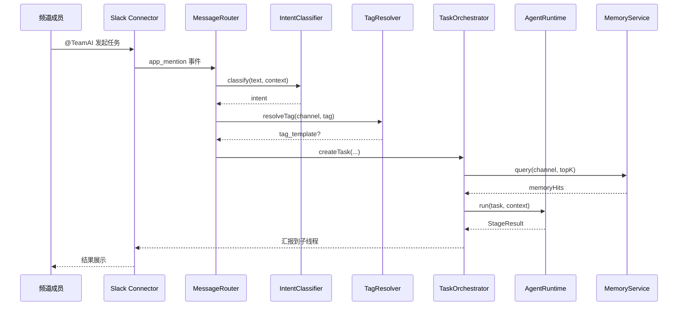
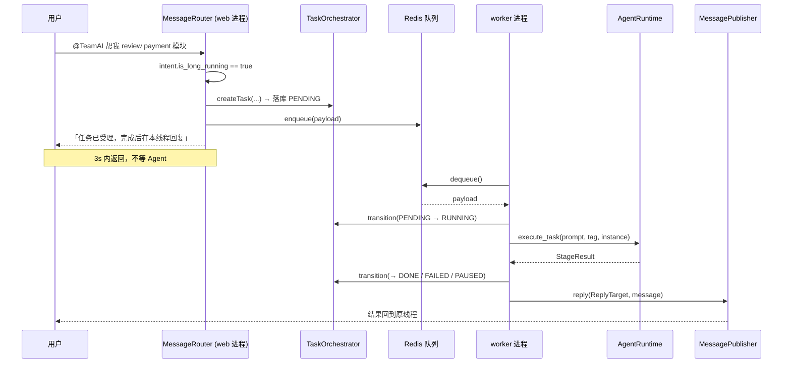
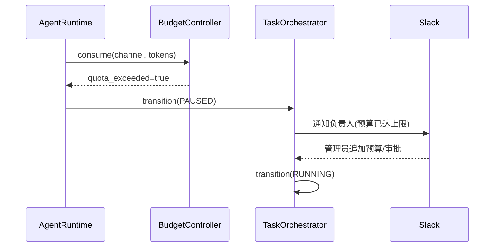

# TeamAI Python 代码设计文档

Feature Name: claude-tag-collaboration
Updated: 2026-08-06
Status: Draft v1.0

## 1. 技术栈选型

| 领域 | 选型 | 理由 |
|------|------|------|
| 语言 | Python 3.11+ | asyncio 原生异步，AI Agent 生态成熟 |
| Web 框架 | FastAPI | Admin API 与健康检查，异步优先 |
| Slack 集成 | slack-bolt (AsyncApp) | 官方 SDK，事件驱动 + Socket Mode |
| 飞书集成 | lark-oapi + cryptography | 官方 SDK（长连接/消息回复），回调加解密自行实现（见 adapters/feishu/crypto.py） |
| LLM 客户端 | pydantic-ai v2（内置 AnthropicModel + UsageLimits + Agent.tool） | 原生 async、工具调用、预算管控、结构化输出开箱即用 |
| 数据库 | PostgreSQL + SQLAlchemy 2.0 (async) | 任务/实例/审计持久化 |
| 迁移 | alembic（async 模板） | 生产建库走 `alembic upgrade head`；开发建表保留 `create_all` |
| 向量库 | Qdrant（本地开发用 Chroma） | 频道记忆语义检索 |
| 任务队列 | Redis list（RedisTaskQueue）+ APScheduler | 异步长任务与定时任务。未引入 ARQ：队列语义只需 rpush/lpop，自实现即可，少一个依赖 |
| 调度 | APScheduler（cron 语义） | 定时/周期任务 |
| 配置 | pydantic-settings | 类型安全的环境配置 |
| 测试 | pytest + pytest-asyncio | 单元/集成/评测 |
| 包管理 | poetry 或 uv | 依赖锁定 |

## 2. 项目目录结构

```
├── Makefile                      # 开发与部署入口，make help 看全部目标
├── pyproject.toml
├── .env.example                  # 凭据与连接串示例，拷为 .env（不入库）
├── config/
│   └── config.example.yaml       # 非敏感可调项示例，拷为 config/config.yaml（不入库）
├── deploy/
│   ├── Dockerfile                # web/worker 共用一份镜像，靠启动命令区分
│   ├── Dockerfile.dockerignore   # 上下文忽略规则（放这里也生效，见 §3.3）
│   └── docker-compose.yml        # 本地依赖：postgres + redis + qdrant
├── alembic.ini                   # alembic 配置（URL 走 settings，见 migrations/env.py）
├── migrations/                   # 数据库迁移（async 模板）
│   ├── env.py                    # 接 Base.metadata + settings.database_url
│   └── versions/                 # 迁移文件（自动生成，不 lint）
├── docs/                         # PRD / 设计 / 实施文档
├── app/                          # 进程入口（一个子包一个进程，只做装配与启动）
│   ├── backend/main.py           # web 进程：create_app() 遍历连接器装配 + uvicorn 启动
│   └── worker/main.py            # worker 进程：队列消费循环 + Scheduler 生命周期 + 回帖
├── src/
│   └── teamai/
│       ├── container.py          # 组合根：装配全部依赖 + 进程内共享单例
│       ├── config.py             # Settings：.env（凭据）+ config/config.yaml（可调项）
│       ├── domain/               # 领域模型与抽象契约（无外部依赖）
│       │   ├── identity.py      # gen_id：ULID 实体 ID（各层共用，按时间可排序）
│       │   ├── models/           # 领域模型（子包 __init__ 汇总导出）
│       │   │   ├── channel.py    # ChannelInstance
│       │   │   ├── task.py       # Task + TaskStatus 状态机
│       │   │   ├── memory.py     # MemoryEntry / Preference
│       │   │   ├── tag.py        # TagTemplate
│       │   │   ├── policy.py     # PermissionPolicy / AmbientRule
│       │   │   ├── budget.py     # BudgetQuota
│       │   │   └── audit.py      # AuditLog
│       │   ├── repositories/     # 仓储抽象接口（依赖倒置，一聚合一文件）
│       │   │   ├── task.py       # TaskRepository
│       │   │   ├── memory.py     # MemoryRepository
│       │   │   ├── tag.py        # TagRepository
│       │   │   ├── policy.py     # PolicyRepository
│       │   │   ├── budget.py     # BudgetRepository
│       │   │   ├── channel.py    # ChannelRepository
│       │   │   └── audit.py      # AuditRepository
│       │   ├── ports/            # 外部系统端口
│       │   │   ├── queue.py      # TaskQueue / QueuePayload
│       │   │   ├── dedup.py      # EventDeduplicator（事件去重）
│       │   │   └── messaging.py  # MessagePublisher / ReplyTarget（出向消息）
│       │   └── services/         # 领域服务
│       │       └── audit_writer.py  # AuditLogWriter（application/agent 共用）
│       ├── application/          # 用例层（编排逻辑）
│       │   ├── events.py         # IncomingMessage（平台无关规范入向事件）
│       │   ├── router.py         # MessageRouter（唯一协调者，route(msg) 收 IncomingMessage）
│       │   ├── orchestrator.py   # TaskOrchestrator
│       │   ├── intent.py         # IntentClassifier + Intent（含意图→模型档位）
│       │   ├── channel.py        # ChannelService
│       │   ├── memory.py         # MemoryService
│       │   ├── tag.py            # TagResolver
│       │   └── budget.py         # BudgetController
│       ├── agent/                # Agent 执行层
│       │   ├── runtime.py        # AgentRuntime（核心循环）
│       │   ├── context.py        # ContextBundle 组装
│       │   ├── models.py         # pydantic-ai Agent/模型装配与模型分级
│       │   └── prompts.py        # 系统提示词模板
│       ├── tools/                # 工具层
│       │   ├── base.py           # BaseTool 抽象
│       │   ├── registry.py       # ToolRegistry
│       │   ├── github_tool.py    # GitHubConnector
│       │   ├── monitoring_tool.py
│       │   └── crm_tool.py
│       ├── infrastructure/       # 基础设施层（只放实现，抽象在 domain）
│       │   ├── db.py             # SQLAlchemy async engine/session + Base
│       │   ├── orm/              # 表定义按聚合分模块
│       │   │   ├── task.py       # TaskModel
│       │   │   ├── channel.py    # ChannelInstanceModel
│       │   │   ├── memory.py     # MemoryEntryModel + PreferenceModel
│       │   │   ├── tag.py        # TagTemplateModel
│       │   │   ├── policy.py     # PolicyModel
│       │   │   ├── budget.py     # BudgetQuotaModel
│       │   │   └── audit.py      # AuditLogModel
│       │   ├── repositories/     # 仓储实现，与 domain/repositories/ 一一对应
│       │   │   ├── task.py       # SQLTaskRepository + 领域↔表 mapper
│       │   │   ├── memory.py     # SQLMemoryRepository
│       │   │   ├── tag.py        # SQLTagRepository
│       │   │   ├── policy.py     # SQLPolicyRepository（JSON 字段转换）
│       │   │   ├── budget.py     # SQLBudgetRepository
│       │   │   ├── channel.py    # SQLChannelRepository
│       │   │   └── audit.py      # SQLAuditRepository（JSON 字段转换）
│       │   ├── redis_client.py   # RedisClientProvider（进程内共享连接池）
│       │   ├── queue.py          # RedisTaskQueue（TaskQueue 实现）
│       │   ├── dedup.py          # RedisEventDeduplicator（SET NX EX，内存兜底）
│       │   ├── vector.py         # Qdrant/Chroma 适配器
│       │   ├── messaging/        # 出向消息发送（MessagePublisher 实现），按平台分模块
│       │   │   ├── registry.py   # PublisherRegistry：按 target.platform 分发
│       │   │   ├── slack.py      # SlackPublisher（slack_sdk AsyncWebClient）
│       │   │   └── feishu.py     # FeishuPublisher（lark areply）
│       │   └── scheduler.py      # APScheduler 封装
│       ├── adapters/             # 平台适配层（入向翻译 + 连接器）
│       │   ├── base.py           # PlatformConnector 抽象：mount/startup/shutdown
│       │   ├── slack/            # Slack 适配子包
│       │   │   ├── __init__.py   # build_connector()（凭据不全返回 None）
│       │   │   ├── app.py        # AsyncApp 装配 + SlackConnector（Events API / Socket Mode）
│       │   │   └── translator.py # event → IncomingMessage + dedup_key
│       │   ├── feishu/           # 飞书适配子包
│       │   │   ├── __init__.py   # build_connector()
│       │   │   ├── connector.py  # FeishuConnector：模式选择 + bot open_id 拉取
│       │   │   ├── callback.py   # HTTP 回调：解密/验签/challenge/去重/派发
│       │   │   ├── ws.py         # 长连接：独立线程 + 跨 loop fire-and-forget 桥接
│       │   │   ├── crypto.py     # AES 解密 + 签名校验（SDK 逻辑的 async 拆出）
│       │   │   └── translator.py # im.message.receive_v1 → IncomingMessage
│       │   └── admin/           # Admin API，按资源分模块
│       │       ├── __init__.py  # build_admin_router：挂 /api 前缀并逐个 include
│       │       ├── serializers.py # 领域对象 → JSON
│       │       ├── memory.py    # /channels/{id}/memories、/memories/{id}
│       │       ├── budget.py    # /channels/{id}/budget
│       │       ├── policy.py    # /channels/{id}/policy
│       │       ├── audit.py     # /channels/{id}/audit
│       │       ├── task.py      # /channels/{id}/tasks
│       │       └── tag.py       # /channels/{id}/tags
└── tests/
    ├── conftest.py
    ├── unit/                     # 状态机/预算/鉴权单元测试
    ├── integration/              # Slack 模拟全链路测试
    └── e2e/                      # 频道评测集
```

## 3. 分层依赖规则

```
app/（进程入口）→ adapters ─┬→ application → agent → tools
                            │        ↓          ↓       ↓
                            └→ container      domain ←──┘
                                     ↓            ↑
                               infrastructure ─────┘
```

依赖只允许向下，`domain` 为叶子层（零内部依赖）。原先另有一个 `util/` 目录承载跨层工具，但它只装了 `gen_id`，且需要一条「任何层都可导入 util」的特例规则；`gen_id` 移入 `domain/identity.py` 后该目录与特例一并撤销 —— domain 本就是所有层的公共底座，跨层词汇放这里无需开例外。

`app/` 在包外且不随 wheel 分发（`hatchling` 只打 `src/teamai`），因此方向严格单向：`app.*` 可 import `teamai.*`，`teamai.*` 不得 import `app.*`，否则安装态直接 ImportError。此约束由 `tests/unit/test_layering.py::test_src不依赖进程入口` 校验。

- `domain` 无外部依赖，内部按类型分四个子包：领域模型（`models/`）+ 仓储接口（`repositories/`）+ 外部端口（`ports/`）+ 领域服务（`services/`）。各子包 `__init__.py` 汇总导出，跨层调用方写 `from teamai.domain.models import Task`；`domain` 内部互相引用走具体子模块（如 `teamai.domain.models.task`）以免绕回包级 `__init__`
- `application` 依赖 domain / agent / tools，**不依赖 infrastructure**——持久化与队列均通过 domain 声明的抽象访问
- `application` 平铺不分子包：整层同质（六个用例服务 + 一个协调者 `router.py`），没有 domain 那样的类型轴可分，534 行也撑不起嵌套。文件名不带 `_service` 后缀（这一层全是 service，后缀是噪声）、用单数，聚合型的与下层同名：`domain/models/tag.py` ↔ `infrastructure/repositories/tag.py` ↔ `application/tag.py`
- `agent` 依赖 domain + tools，不依赖 application（避免与 `application/router.py` 形成环）
- `infrastructure` 只依赖 domain，实现 domain 声明的抽象（`SQL*Repository`、`RedisTaskQueue`）。内部布局镜像 domain：`orm/` 与 `repositories/` 都按聚合分模块，一个聚合的表、mapper 与仓储实现路径同名，改字段时三边位置可推测
- `infrastructure/orm/__init__.py` **必须导入全部表模块**：SQLAlchemy 只在类定义被执行时才把表注册进 `Base.metadata`，而 `init_db()` 依赖 `Base.metadata.create_all` 建表，漏一个 import 对应的表就会静默不创建。此约束由 `tests/unit/test_orm_registry.py` 静态校验
- `container.py` 是唯一同时 import application 与 infrastructure 的模块（组合根，负责绑定抽象与实现）。同时持有进程内共享单例 `get_container()`：容器内含共享 AsyncSession 与 Redis 连接池，重复装配会按调用次数放大连接数
- Redis 连接由 `infrastructure/redis_client.py` 的 `RedisClientProvider` 统一持有，`queue` 与 `dedup` 共用同一个，全进程一个连接池。**不做模块级单例**：redis-py 的连接绑定创建它的事件循环，跨循环使用会抛 `Event loop is closed`，而 pytest-asyncio 每个测试一个新循环。连接长期存活，故须由进程入口在退出路径调用 `container.aclose()`，否则留下 `ResourceWarning: unclosed transport`
- `adapters` 最外层，接收已装配好的 Container。`admin/` 每个资源模块导出一个 `build_*_router(container)`，子路由自身不带前缀、完整路径写在模块内，`/api` 前缀由 `build_admin_router` 统一挂
- `adapters/admin/__init__.py` **必须 include 全部资源路由**：漏一个该组路由静默不注册，请求时才 404。此约束由 `tests/unit/test_admin_routes.py` 校验（AST 静态检查 + 完整路由表断言）。注意路由表须从 `app.openapi()` 取 —— FastAPI 把 `include_router` 存成惰性对象，遍历 `app.routes` 只能看到 `/api/health`

抽象归属原则：**谁消费、谁定义**。接口放在消费方所在层或其下层，实现放在 infrastructure，从而保证 import 方向与依赖倒置一致。

### 3.1 两个进程入口

| 进程 | 启动 | 职责 |
|------|------|------|
| web | `python -m app.backend.main`，或 `uvicorn app.backend.main:create_app --factory` | Admin API + 各平台连接器（遍历 CONNECTOR_BUILDERS；Slack 二选一、飞书回调/长连接二选一，由 platforms.* 配置决定） |
| worker | `python -m app.worker.main` | 消费长任务队列 + APScheduler 定时调度 + 结果经 MessagePublisher 回帖 |

拆两个进程的理由：长任务是小时/天级，与 Slack 事件的毫秒级响应放同一进程会互相拖累——长任务卡住事件循环会让 Slack 事件超时重投，而 web 按 QPS 扩容也会把 worker 副本一并放大、导致同一任务被多次执行。

两者共用的启动动作是建表 `init_db_or_warn()`（在 `infrastructure/db.py`）：失败只告警不中断，否则 Postgres 未就绪时 `/api/health` 也探不到，编排系统无从区分「进程没起来」与「依赖没起来」。

### 3.2 配置来源

配置按「是否敏感」分两处，都不入库，各留一份 example：

| 文件 | 装什么 | 例子 |
| --- | --- | --- |
| `.env` | 凭据与连接串 | `SLACK_BOT_TOKEN`、`FEISHU_APP_ID`/`FEISHU_APP_SECRET`、`ANTHROPIC_API_KEY`、`DATABASE_URL`、`REDIS_URL`、`QDRANT_URL` |
| `config/config.yaml` | 非敏感可调项 | `model.*`、`queue.name`、`event_dedup.ttl_seconds`、`qdrant.collection`、`budget.period`、`admin_api.*`、`context.*`、`platforms.*` |

优先级 **环境变量 > `.env` > `config/config.yaml` > 字段默认值**（`src/teamai/config.py`）。两个文件缺失或留空都不报错，直接回落默认值 —— 新克隆下来不配任何东西也能跑起来。

`config/config.yaml` 里嵌套分组只为可读，加载时由 `FlatYamlSettingsSource` 按下划线展平成平铺字段（`model.light_primary` → `settings.model_light_primary`），因此代码里访问方式不变。pydantic-settings 自带的 `YamlConfigSettingsSource` 按字段名匹配顶层键，嵌套 dict 会原样传给校验器并因 `extra_forbidden` 报错，故必须先展平。

这层衔接是隐式的：**展平后的名字与 `Settings` 字段名对不上时不会报错，只是写了不生效**。`tests/unit/test_config.py` 因此校验 `config/config.example.yaml` 的每个键都对应真实字段、且示例值与默认值一致。

## 4. 核心接口设计

### 4.1 domain/models/task.py — 任务状态机

```python
from enum import Enum
from dataclasses import dataclass, field
from datetime import datetime

class TaskStatus(Enum):
    PENDING = "PENDING"
    RUNNING = "RUNNING"
    WAITING_INPUT = "WAITING_INPUT"
    DONE = "DONE"
    FAILED = "FAILED"
    CANCELLED = "CANCELLED"
    PAUSED = "PAUSED"          # 预算暂停

    # 合法迁移表：state -> 允许的下一状态
    TRANSITIONS = {
        PENDING: {RUNNING, CANCELLED, FAILED},
        RUNNING: {WAITING_INPUT, DONE, FAILED, CANCELLED, PAUSED},
        WAITING_INPUT: {RUNNING, CANCELLED},
        PAUSED: {RUNNING, CANCELLED},
        DONE: set(),
        FAILED: set(),
        CANCELLED: set(),
    }

    def can_transit(self, to: "TaskStatus") -> bool:
        return to in self.TRANSITIONS[self]

@dataclass
class Task:
    id: str
    channel_instance_id: str
    thread_ts: str
    requester_id: str
    intent: str
    tag_name: str | None = None
    status: TaskStatus = TaskStatus.PENDING
    current_stage: str | None = None
    owner_id: str | None = None
    canceled_by: str | None = None
    created_at: datetime = field(default_factory=datetime.utcnow)
    updated_at: datetime = field(default_factory=datetime.utcnow)

    def transition(self, to: TaskStatus, actor: str) -> None:
        if not self.status.can_transit(to):
            raise InvalidTransition(self.status, to)
        self.status = to
        self.updated_at = datetime.utcnow()
```

### 4.2 agent/runtime.py — 核心 Agent 循环

```python
from pydantic_ai import Agent, RunContext, UsageLimitExceeded, UsageLimits
from pydantic_ai.models.anthropic import AnthropicModel

class AgentRuntime:
    def __init__(self, agent_factory: ModelRegistry, tools: ToolRegistry,
                 memory: MemoryService, budget: BudgetController,
                 audit: AuditLogWriter):
        self._registry = agent_factory      # 模型分级注册表
        self._tools = tools
        self._memory = memory
        self._budget = budget
        self._audit = audit

    async def run(self, task: Task, context: ContextBundle) -> StageResult:
        # 预算前置检查
        if not await self.budget.check_quota(task.channel_instance_id):
            await self._pause_for_budget(task)
            return StageResult(status="PAUSED")

        agent = self._registry.build(context.model_level)   # 按任务分级选型
        for tool_name in context.allowed_tools:             # 权限白名单注入工具
            agent.tool(self._tools.handler(tool_name))
        agent.system_prompt = context.system_prompt

        limits = UsageLimits(
            total_tokens_limit=self.budget.remaining(task.channel_instance_id),
        )
        try:
            result = await agent.run(
                context.user_prompt,
                deps=context.policy,            # RunContext.deps 传入权限包
                usage_limits=limits,
            )
            await self.budget.consume(task.channel_instance_id,
                                      result.usage.total_tokens)
            return StageResult(status="DONE", output=result.output)
        except UsageLimitExceeded:
            await self._pause_for_budget(task)
            return StageResult(status="PAUSED")
```

### 4.3 agent/models.py — 模型分级注册表（替代 LLMGateway）

```python
from pydantic_ai import Agent
from pydantic_ai.models.anthropic import AnthropicModel
from pydantic_ai.models.fallback import FallbackModel

class ModelRegistry:
    """按 model_level 返回预装配的 Agent。简单任务轻量模型，复杂任务旗舰模型。"""

    def __init__(self, config: ModelConfig):
        self._agents = {
            "light":  Agent(FallbackModel(
                          AnthropicModel(config.sonnet),   # 主
                          AnthropicModel(config.haiku))),  # 备，自动降级
            "full":   Agent(AnthropicModel(config.opus)), # 复杂任务用旗舰
        }

    def build(self, level: str) -> Agent:
        return self._agents[level]
```

> 注：`result.usage` 提供 `total_tokens`/`cost`/`requests`，替代手写 token 统计；`UsageLimits` 与 Anthropic `task_budget` 共同实现预算硬上限。
```

### 4.4 tools/base.py — 工具抽象

```python
@dataclass
class ToolResult:
    ok: bool
    data: dict
    tokens: int = 0
    error: str | None = None

class BaseTool(ABC):
    name: str                      # 如 "github.pr_create"
    description: str
    input_schema: dict             # JSON Schema

    @abstractmethod
    async def call(self, args: dict, auth_scope: PermissionPolicy) -> ToolResult:
        ...
```

### 4.5 domain/repositories/ — 仓储接口（依赖倒置）

```python
class TaskRepository(ABC):
    @abstractmethod
    async def create(self, task: Task) -> None: ...
    @abstractmethod
    async def update(self, task: Task) -> None: ...
    @abstractmethod
    async def get(self, task_id: str) -> Task | None: ...
    @abstractmethod
    async def list_by_channel(self, channel_instance_id: str,
                              status: TaskStatus | None = None) -> list[Task]: ...

class MemoryRepository(ABC):
    @abstractmethod
    async def store(self, entry: MemoryEntry) -> None: ...
    @abstractmethod
    async def query(self, channel_instance_id: str, query: str,
                    top_k: int) -> list[MemoryEntry]: ...
    @abstractmethod
    async def set_preference(self, pref: Preference) -> None: ...
```

### 4.6 adapters/ — 平台适配与连接器

入方向：各平台 translator 把 webhook 事件归一成 `IncomingMessage`（`application/events.py`），
`router.route(msg)` 之后不再感知平台。出方向：经 `MessagePublisher` 端口由
`PublisherRegistry` 按 `target.platform` 分发，同步（web 直回）与异步（worker 回帖）
两条链路共用。

进程入口只认识 `PlatformConnector`（`adapters/base.py`），`CONNECTOR_BUILDERS`
里登记的 `build_connector(container)` 凭据不全返回 `None`：

```python
# app/backend/main.py
connectors = [c for b in CONNECTOR_BUILDERS if (c := b(container)) is not None]

@asynccontextmanager
async def lifespan(app):
    await init_db_or_warn()
    for c in connectors:
        await c.startup()
    try:
        yield
    finally:
        for c in reversed(connectors):
            await c.shutdown()
        await container.aclose()

for c in connectors:
    c.mount(app)   # HTTP 回调模式挂路由；长连接模式为 no-op
```

Slack 侧 handler 的同步回复仍走 slack-bolt 的 `say()`（少一次往返）；飞书回调与
长连接均经 `FeishuConnector.dispatch()`（route + 按 `is_mention` 条件回复），
长连接模式的 handler 是 SDK 同步回调，只能 fire-and-forget 投递到主 loop
（`adapters/feishu/ws.py`）。

## 5. 关键数据流

### 5.1 响应式任务（@TeamAI）



上图是短任务（同步）链路。长任务在 `createTask` 之后分叉：



两点约定：状态留在 PENDING 直到 worker 取走（据此区分「排队中」与「执行中」，超时巡检才能判断卡在哪一段）；`ReplyTarget` 由 `ChannelInstance` 与 `task.thread_ref` 拼出，故队列载荷无需携带平台信息。入队抛 `ConnectionError` 时 router 降级为同步执行。

验证入口：`make verify-longtask`（真 Redis + 内存仓储，验证序列化往返）与 `make verify-longtask-db`（真 Postgres + 真 Redis，配合 `make run-worker` 验证跨进程可见性）。

### 5.2 预算暂停链路



## 6. 关键实现决策

| 决策点 | 方案 | 理由 |
|--------|------|------|
| 长任务执行模型 | worker 进程轮询消费 Redis 队列（app/worker/main.py） | 与请求线程解耦，支持小时/天级任务 |
| 同步/异步分流判据 | `Intent.is_long_running`（按意图 kind 判定，见 application/intent.py） | 平台事件响应窗口只有 3s，多轮工具调用的意图必须转异步；单轮生成的同步回更快 |
| 入队失败降级 | MessageRouter 捕获 ConnectionError，就地同步执行 | Redis 不可用时功能不整体失效，代价是本次响应变慢 |
| 任务状态持久化 | PostgreSQL 事务 + 状态机校验 | 崩溃恢复与审计一致 |
| 事务边界 | SQL 仓储的写方法各自 commit | 容器持有单个共享 session，不提交则改动对别的进程不可见（worker 会读不到任务）。代价是「建任务」与「写审计」分属两个事务；要整条消息一个事务需引入 UnitOfWork 或 session-per-task |
| 记忆检索 | 文本 embedding 入 Qdrant + KV 存偏好 | 语义召回 + 精确偏好 |
| 幂等 | 按信封 `event_id` 去重，Redis `SET NX EX` 原子记账 | 防 Slack 重投/乱序 |
| 模型分级 | ModelRegistry.build(model_level) 预装配不同 Agent | 简单任务轻量模型，复杂任务旗舰模型 |
| 预算硬上限 | pydantic-ai UsageLimits + Anthropic task_budget | 超限抛 UsageLimitExceeded → 任务 PAUSED |
| 上下文压缩 | 最近优先 + 历史摘要化 | 防止长任务上下文溢出 |
| 配置隔离 | 每频道 policy 独立加载进 ContextBundle | 工具鉴权不依赖调用人个人权限 |

## 7. 测试策略映射

| 测试类型 | 覆盖内容 | 对应设计文档章节 |
|----------|----------|------------------|
| 单元测试 | Task 状态机合法迁移、Budget 配额核算、Permission 鉴权矩阵 | §5 正确性属性 |
| 属性测试 | 状态机任意非法迁移必抛异常；预算在任意序列下不超过上限（pydantic-ai UsageLimits 兜底） | §5 正确性属性 |
| 集成测试 | Slack 模拟事件 → 路由 → 编排 → 回复全链路；记忆写入→检索命中 | §7.2 |
| 跨进程链路 | `tests/integration/test_long_task_flow.py`：真 router + 真 orchestrator + 真 worker.handle_payload 串在共享队列上，验证载荷字段对齐与状态接力（仍全内存，CI 无依赖） | §5.1 |
| 约束固化 | `tests/unit/test_repository_commit.py`：AST 静态断言仓储写方法必须 commit（漏提交则跨进程不可见，同步链路不会暴露） | §6 事务边界 |
| E2E 评测 | 频道评测集（代码审查/数据汇总/文档生成）人工标注 | §7.3 |
| 安全测试 | 频道隔离（ch_A 无法读 ch_B 记忆）；审计完整性断言 | §7.4 |
| 模型降级 | FallbackModel 主模型失败自动切换备模型；重试逻辑由 pydantic-ai 托管 | §3.6 |

## 8. 开发环境与构建

统一入口是根目录 `Makefile`，`make help` 列出全部目标。不在此重复各目标的实现，以文件为准。

上手三步：

```bash
make install   # uv sync，建 .venv 并装依赖
make config    # 从示例生成 config/config.yaml 与 .env（已存在则跳过）
make up        # 起依赖容器：postgres + redis + qdrant
make run-web   # 另开一个终端起 worker：make run-worker
```

开发目标（`lint` / `fmt` / `test` / `check` / `run-*`）直接用本地 `.venv` 跑，不进容器 —— 改代码即时生效，无需重建镜像。容器目标（`up` / `down` / `build` / `logs` / `ps`）管依赖服务与镜像。

**依赖服务见 `deploy/docker-compose.yml`，只含 postgres / redis / qdrant，不含 app 自身。** 其中两点值得留意：

- `name: teamai` 是显式写死的。compose 的默认项目名取自 compose 文件所在目录，本文件在 `deploy/` 下则默认叫 `deploy`；一台机器上多个仓库都把 compose 放在 `deploy/` 时会共用命名空间，compose 会把别的项目里 `project=deploy` 且同 service 名的容器当成本项目的并直接 recreate。本文件从仓库根移入 `deploy/` 时就撞掉过邻近仓库的 postgres 容器。
- 宿主端口可用 `POSTGRES_PORT` / `REDIS_PORT` / `QDRANT_PORT` 覆盖（默认 5432 / 6379 / 6333），开发机上端口常已被占。这几个变量由 compose 读取，因此 Makefile 里的 `docker compose` 显式带了 `--env-file .env --project-directory .` —— compose 的 project directory 默认取 compose 文件所在目录，不指定的话它找的是 `deploy/.env` 而非仓库根的 `.env`，改了也不生效。

### 8.1 镜像

`deploy/Dockerfile` 一份镜像同时供 web 与 worker，靠启动命令区分（默认 `alembic upgrade head && python -m app.backend.main` —— 启动前先应用迁移，幂等；worker 容器用 `python -m app.worker.main` 且自行先跑迁移）。多阶段构建：uv 镜像装依赖，运行阶段只留 `python:3.11-slim` + venv，非 root 运行。

```bash
make build      # docker build -f deploy/Dockerfile -t teamai:latest .
make image-run  # 起 web，挂载本机 config/ 与 .env
```

三处不显然但必要的细节：

- **构建上下文必须是仓库根**，因为要 `src/`、`app/`、`migrations/`、`alembic.ini`、`pyproject.toml`、`uv.lock`。故命令形如 `docker build -f deploy/Dockerfile .`。
- **`app/` 必须单独 COPY。** wheel 只打 `src/teamai`（`tool.hatch.build.targets.wheel`），进程入口在包外，不随包安装进来。`migrations/` 与 `alembic.ini` 同理单独拷入。
- **`uv sync` 必须带 `--no-editable`。** 默认的 editable 安装只在 site-packages 留一个 `.pth` 指向构建阶段的 `/build/src`，而运行阶段只拷 venv 不拷源码，那个路径不存在 —— 结果是镜像能构建成功但一 `import teamai` 就 `ModuleNotFoundError`。
- 忽略规则在 `deploy/Dockerfile.dockerignore` 而非仓库根的 `.dockerignore`：上下文根是仓库根，而 `.dockerignore` 默认只从上下文根读取；BuildKit 支持 `<dockerfile>.dockerignore` 这一形式，故可与 Dockerfile 放在一起。**实测确认过它生效**（排除后上下文 12.69 kB，不排除则 `.venv` 的 323 MB 一并进去）。

配置不进镜像：`config/config.yaml` 与 `.env` 都含环境相关内容，运行时挂载或用环境变量注入。镜像里只带一份 `config/config.example.yaml` 便于进容器排查时对照字段名。

## 9. 参考

[^1]: (文档) - [PRD-claude-tag.md](./PRD-claude-tag.md) - 产品需求文档
[^2]: (文档) - [Design-claude-tag.md](./Design-claude-tag.md) - 技术设计文档
