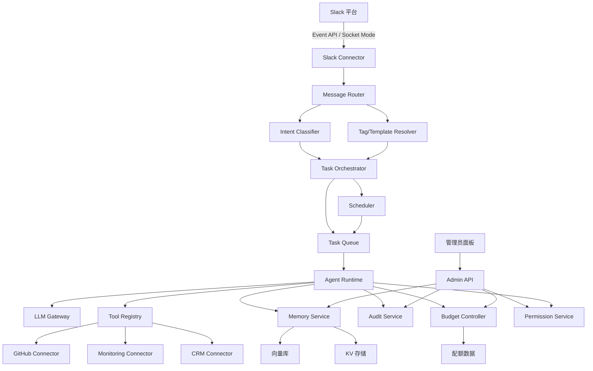

# TeamAI 技术设计文档（对标 Claude Tag）

Feature Name: claude-tag-collaboration
Updated: 2026-08-06
Status: Draft v1.0

## 1. Description

本设计实现对标 Claude Tag 的团队协作 AI（TeamAI）：一个嵌入企业通讯平台（首期 Slack）的共享 AI 协作成员。系统在频道中部署共享 Agent 实例，支持多人接力、频道记忆、异步/定时任务、工具调用与主动介入（Ambient Mode），并具备组织/频道级预算管控、权限隔离与审计能力。

设计遵循以下原则：
- **频道隔离**：各频道实例的上下文、记忆、工具范围相互独立
- **异步优先**：长任务以任务编排状态机驱动，脱离请求线程独立运行
- **可治理**：所有行为可审计，预算有硬上限
- **模型无关**：Agent 运行时通过统一接口适配 LLM，允许按任务分级选型

## 2. Architecture



### 2.1 架构说明

系统为事件驱动的分层架构：

1. **接入层**（Slack Connector）：订阅频道事件（message、app_mention、reaction 等），将 Slack 事件转换为内部规范事件。同时提供 `chat.postMessage`、`chat.postEphemeral` 等发送能力。Beta 期采用 Socket Mode 降低网络部署复杂度。

2. **路由层**（Message Router）：根据消息内容、线程上下文、@ 提及与标签激活状态，将事件分派给意图分类器或标签解析器。普通响应式任务走意图分类，标签激活任务（如 `code_review`）走模板解析。

3. **编排层**（Task Orchestrator）：负责任务生命周期管理。短任务同步执行；长任务拆分为多阶段，写入任务队列由 Agent Runtime 异步消费；定时任务由 Scheduler 按 cron 语义触发。

4. **执行层**（Agent Runtime）：核心 Agent 循环（感知 → 规划 → 工具调用 → 结果合成），每次调用 LLM Gateway 获取模型输出，调用 Tool Registry 执行工具，将阶段性结果写回任务子线程。

5. **记忆层**（Memory Service）：频道级记忆读写。偏好与背景知识统一存 memory_entries（偏好是 `type='PREFERENCE'` 的行：不建向量、检索时全量带上；背景知识经 embedding 入向量库按语义召回），支持语义检索。

6. **治理层**（Admin API / Permission / Budget / Audit）：管理员面板、权限策略、预算配额、审计日志四者协同，保证可治理性。

## 3. Components and Interfaces

### 3.1 Slack Connector

- **职责**：事件订阅、消息发送、线程操作
- **接口**：
  - `onEvent(event: SlackEvent) -> InternalEvent`
  - `postMessage(channel, threadTs, text, blocks) -> MessageRef`
  - `reactToMessage(channel, ts, emoji)`
  - `mentionUsers(channel, threadTs, userIds)`
- **失败处理**：Slack 限流 429 时指数退避重试；Socket 断开自动重连

### 3.2 Message Router

- **职责**：事件分派、标签/模板解析
- **接口**：
  - `route(event: InternalEvent) -> RoutingDecision`
  - `resolveTag(channelId, tagName) -> TagTemplate | null`

### 3.3 Intent Classifier

- **职责**：识别任务意图（代码审查、数据分析、文档、工具操作、查询、闲谈）
- **接口**：`classify(text, context) -> Intent`
- **实现**：基于 LLM 的零样本分类 + 关键词规则兜底；分类置信度低于阈值时降级为"查询/闲谈"并返回快速响应

### 3.4 Task Orchestrator

- **职责**：任务创建、状态机推进、阶段拆解、进度同步
- **接口**：
  - `createTask(channelId, requesterId, intent, payload) -> TaskId`
  - `advance(taskId, stageResult)`
  - `requestInput(taskId, question) -> Promise<UserInput>`
  - `cancel(taskId, cancelerId)`
  - `listTasks(channelId, filter) -> Task[]`
- **状态机**：`PENDING → RUNNING → WAITING_INPUT → RUNNING → DONE | FAILED | CANCELLED | PAUSED(budget)`

### 3.5 Agent Runtime

- **职责**：Agent 循环执行、工具编排、上下文组装
- **接口**：
  - `run(taskId, session) -> StageResult`
  - `buildContext(taskId, memoryHits) -> ContextBundle`
- **上下文组装**：频道记忆检索结果 + 线程历史 + 工具 Schema + 权限白名单

### 3.6 LLM Gateway

- **职责**：统一模型调用、重试、token 统计
- **接口**：`complete(messages, options) -> LLMResponse`
- **策略**：按任务分级选型（简单查询用轻量模型，复杂任务用旗舰模型）；失败重试 3 次后降级

### 3.7 Tool Registry 与 Connectors

- **职责**：工具注册、调用鉴权、结果格式化
- **接口**：
  - `register(tool: ToolDefinition)`
  - `call(toolName, args, authScope) -> ToolResult`
- **内置工具**：GitHub Connector（PR 创建、代码读取、issue 操作）、Monitoring Connector（Datadog/Sentry 告警查询）、CRM Connector（Salesforce 数据查询）
- **鉴权**：每次调用经 Permission Service 校验该频道权限包，未授权直接拒绝并提示

### 3.8 Memory Service

- **职责**：频道记忆读写、语义检索、跨频道授权
- **接口**：
  - `store(channelId, entry)`（`type=PREFERENCE` 即偏好；偏好不建向量）
  - `query(channelId, query, topK) -> MemoryHit[]`（语义命中排除偏好；该频道全部现行偏好另行全量带上）
  - `adminList(channelId) / adminEdit(id) / adminDelete(id)`（录入偏好即 POST `type=PREFERENCE` 的记忆）
- **跨频道授权**：仅当管理员开启该实例的跨频道学习授权且目标频道为公共频道时，检索才允许跨频道

### 3.9 Budget Controller

- **职责**：组织/频道级 token 配额核算、硬上限执行
- **接口**：`checkQuota(channelId) -> {allowed: bool, remaining}`、`consume(channelId, tokens)`
- **执行**：每次 LLM 调用前检查；达到上限置任务为 PAUSED 并通知负责人

### 3.10 Permission Service

- **职责**：频道权限包管理、工具范围控制、Ambient 行为规则
- **接口**：
  - `getPolicy(channelId) -> PermissionPolicy`
  - `setPolicy(admin, channelId, policy)`
  - `canUseTool(policy, toolName) -> bool`
  - `ambientRules(channelId) -> AmbientRule[]`

### 3.11 Audit Service

- **职责**：行为审计留痕
- **接口**：`record(event: AuditEvent)`
- **记录内容**：时间、频道、发起人、任务 ID、动作、工具调用、token 消耗、结果
- **存储**：仅追加日志，保留 ≥ 180 天，支持按频道/人员导出

### 3.12 Scheduler

- **职责**：定时/周期任务触发
- **接口**：`schedule(cron, taskPayload)`、`cancel(scheduleId)`
- **实现**：基于 cron 表达式；触发时创建任务入队；最小周期 1 小时（对齐云上运行约束）

### 3.13 Admin API

- **职责**：管理员面板后端
- **接口**：频道实例管理、记忆管理、预算配置、权限策略、审计查询、标签管理

## 4. Data Models

### 4.1 ChannelInstance

```json
{
  "id": "ch_123",
  "platform": "slack",
  "channelId": "C123456",
  "workspaceId": "T123456",
  "agentIdentity": "ai_001",
  "ambientEnabled": false,
  "crossChannelLearning": false,
  "policyId": "pol_001",
  "createdAt": "2026-08-06T00:00:00Z"
}
```

### 4.2 Task

```json
{
  "id": "task_001",
  "channelInstanceId": "ch_123",
  "threadTs": "1722900000.000100",
  "requesterId": "U123",
  "intent": "code_review",
  "tagName": "code_review",
  "status": "RUNNING",
  "stages": ["analyze", "review", "report"],
  "currentStage": "review",
  "budgetPaused": false,
  "ownerId": "U456",
  "canceledBy": null,
  "createdAt": "2026-08-06T08:00:00Z",
  "updatedAt": "2026-08-06T08:05:00Z"
}
```

### 4.3 MemoryEntry

```json
{
  "id": "mem_001",
  "channelInstanceId": "ch_123",
  "sourceUserId": "U123",
  "type": "BACKGROUND_KNOWLEDGE",
  "content": "支付模块依赖 redis 缓存，变更需同步刷新缓存",
  "embeddingRef": "vec_001",
  "source": "DISTILLED",
  "supersededBy": null,
  "supersededAt": null,
  "createdAt": "2026-08-06T09:00:00Z"
}
```

`type` 取 `BACKGROUND_KNOWLEDGE` / `DECISION` / `FACT` / `PREFERENCE` 之一。`source` 记「这条是谁写下的」（`DISTILLED` 蒸馏产出 / `MANUAL` 人工录入 / `EDITED` 蒸馏产出后被人改过），与 `sourceUserId`（哪个用户的话变成了这条）是两件事。`supersededBy` 非空即表示本条已被取代、不再是现行事实，行仍留在库里供排查。

### 4.4 偏好（MemoryEntry 的 PREFERENCE 类型）

偏好没有独立实体与独立表，它是 `type='PREFERENCE'` 的 MemoryEntry，`sourceUserId` 承载「谁设的这条偏好」：

```json
{
  "id": "mem_002",
  "channelInstanceId": "ch_123",
  "sourceUserId": "U123",
  "type": "PREFERENCE",
  "content": "代码审查请优先关注安全漏洞",
  "embeddingRef": null,
  "source": "MANUAL",
  "supersededBy": null,
  "supersededAt": null,
  "createdAt": "2026-08-06T10:00:00Z"
}
```

`embeddingRef` 恒为 null：偏好不建向量。它是「怎么回答」的约束（语气、格式、禁忌），与当前问题的语义相关度无关 —— 按相似度筛会让它在问到无关话题时失效，故检索时无条件全量带上，不参与 top_k 竞争。

### 4.5 TagTemplate

```json
{
  "id": "tag_001",
  "channelInstanceId": "ch_123",
  "name": "code_review",
  "instruction": "请以专业软件开发者的身份审查以下代码，重点关注性能优化、安全漏洞和代码规范。",
  "role": "senior_engineer",
  "outputStyle": "suggestion_list",
  "shared": true,
  "createdBy": "U123",
  "active": true
}
```

### 4.6 PermissionPolicy

```json
{
  "id": "pol_001",
  "channelInstanceId": "ch_123",
  "allowedTools": ["github.read", "github.pr_create", "monitoring.query"],
  "ambientRules": [
    { "trigger": "thread_stale", "params": { "hours": 24 }, "action": "nudge" }
  ],
  "updatedBy": "admin",
  "updatedAt": "2026-08-06T00:00:00Z"
}
```

### 4.7 BudgetQuota

```json
{
  "id": "bq_001",
  "scope": "CHANNEL",
  "channelInstanceId": "ch_123",
  "tokenLimit": 500000,
  "period": "MONTHLY",
  "usedTokens": 120000,
  "state": "ACTIVE"
}
```

### 4.8 AuditLog

```json
{
  "id": "audit_001",
  "ts": "2026-08-06T08:05:12Z",
  "channelInstanceId": "ch_123",
  "userId": "U123",
  "taskId": "task_001",
  "action": "tool_call",
  "detail": { "tool": "github.pr_create", "args_summary": "repo=pay, branch=fix-123" },
  "tokensConsumed": 4200,
  "result": "SUCCESS"
}
```

## 5. Correctness Properties

- **频道隔离不变量**：任意时刻，实例 `ch_A` 的 Agent 上下文与记忆检索 SHALL 仅访问 `ch_A` 的数据，除非 `crossChannelLearning=true` 且目标为已授权公共频道
- **预算硬上限**：任意任务在 token 消耗达到配额时，SHALL 进入 `PAUSED` 状态而非继续执行
- **审计完整性**：每个 Agent 动作 SHALL 产生至少一条 AuditLog，日志仅追加不可变
- **任务终态确定性**：每个任务 SHALL 最终到达 `DONE | FAILED | CANCELLED | PAUSED` 之一，不存在无限 RUNNING
- **工具调用鉴权**：任何工具调用 SHALL 先通过 Permission Service 校验，未授权调用 SHALL 被拒绝
- **状态一致性**：任务状态机迁移 SHALL 满足预定义合法迁移集，非法迁移被拒绝

## 6. Error Handling

| 场景 | 处理策略 |
|------|----------|
| LLM 调用超时/失败 | 重试 3 次（指数退避），失败后任务置 FAILED 并向线程汇报错误原因 |
| 工具调用失败（如 GitHub 429） | 记录错误、按工具限流退避重试；持续失败则降级为仅分析不执行 |
| 预算达到上限 | 任务置 PAUSED，通知负责人并给出已消耗/上限数据 |
| Slack 事件乱序/重复 | 按信封 `event_id` 去重（Redis `SET NX EX`，取不到才退回 channel+ts+subtype）；乱序任务仅追加状态更新 |
| 记忆检索无命中 | 返回空上下文，不阻断执行，并记录"上下文缺失"提示 |
| 用户输入超时未返回 | 任务停留 WAITING_INPUT 超过 24h 触发提醒，48h 后自动取消并通知 |
| 上下文窗口溢出 | 采用最近优先压缩策略，历史摘要化后继续执行 |
| 定时任务触发失败 | 记录审计失败项，下一周期重试，连续 3 次失败暂停该计划并通知管理员 |

## 7. Test Strategy

### 7.1 单元测试
- 各服务接口与状态机迁移合法性测试（Task Orchestrator 状态机全覆盖）
- Budget Controller 配额核算边界（等于/超过/重置周期）
- Permission Service 鉴权矩阵（工具 x 频道 x 策略）

### 7.2 集成测试
- Slack 事件模拟器驱动路由 → 编排 → 执行 → 回复全链路
- 记忆存储与向量检索：写入 → 检索命中率验证（含跨频道授权开关）
- GitHub Connector 使用 mock 服务验证 PR 创建流程与失败重试

### 7.3 端到端评测
- 构建频道级评测集：典型场景（代码审查、Bug 修复、数据汇总、文档生成）golden 数据集
- 每场景运行 Agent 循环，以人工标注的完成率、正确率、返工率评估
- Ambient Mode 专项：注入合成线程事件，验证主动规则触发率与误报率

### 7.4 治理验证
- 审计完整性：自动化断言"每个动作均有一条可追溯 AuditLog"
- 隔离性：安全测试验证 ch_A 无法读取 ch_B 记忆与上下文
- 预算上限：压测确认超额任务必然 PAUSED

## 8. References

[^1]: (调研) - [PRD-claude-tag.md](./PRD-claude-tag.md) - 对标 Claude Tag 的产品需求文档
[^2]: (调研) - Anthropic Claude Tag 发布资料（2026-06-23，首站 Slack，Claude Opus 4.8）
