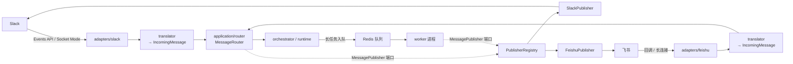

# TeamAI 多平台接入设计文档

Feature Name: multi-platform-connector
Updated: 2026-08-08
Status: Draft v1.0

## 1. 背景与目标

当前只接入 Slack。PRD §8.2 要求扩展至飞书与企业微信，本文给出接入飞书的落地设计，并把「平台」抽象为可插拔的一层，使后续接入企业微信不再需要改动 application 与 domain。

三条约束：

- application / domain 层不得出现任何平台词汇与 SDK 依赖，`tests/unit/test_layering.py` 的既有断言必须全绿。
- 飞书两种接入方式（HTTP 事件回调、WebSocket 长连接）都要支持，与 Slack 的 Events API / Socket Mode 对齐。
- 同步链路（web 进程直接回复）与异步链路（worker 消费长任务后回帖）共用同一套发送抽象，顺带解掉 `app/worker/main.py:63` 的回帖 TODO。

## 2. 现状盘点

平台耦合点仅四处，其余代码已平台无关：

| 位置 | 现状 | 处理 |
|---|---|---|
| `adapters/slack.py` | 唯一 SDK 依赖点，装配 + 两种接入方式 | 拆为 `adapters/slack/` 子包 |
| `app/backend/main.py:39-93` | 硬编码 slack 装配与 `/slack/events` 挂载 | 改为遍历连接器列表 |
| `config.py:67-70,107-114` | `slack_*` 字段与 `slack_enabled` | 增 `feishu_*`，接入方式改显式 mode |
| `domain/repositories/channel.py:15` | `get_by_slack()`，且查询未带 `platform` | 改名并补 `platform` 条件 |

`router.route()` 已带 `platform` 参数、`ChannelInstance.platform` 已入库、`TaskOrchestrator` / `AgentRuntime` / 全部仓储均与平台无关，这是本次改造成本可控的前提。

两个隐藏问题一并解决：

- `ChannelService.get_or_create()` 经 `get_by_slack(channel_id, workspace_id)` 查询，不带 `platform`。两平台的 `channel_id` 空间彼此独立，存在撞车风险。
- ORM 字段宽度不足，飞书 ID 一律超过 32 字符，详见 §8。

## 3. 协议差异对照

概念层面两平台能对应：都是「HTTP 回调 / 长连接」二选一，都有 challenge 式 URL 验证，都为事件分配可用于去重的 `event_id`。但字段语义与鉴权模型差别很大，不能简单套用。

| 维度 | Slack | 飞书 |
|---|---|---|
| 接入方式 | Events API / Socket Mode | 事件回调 / 长连接 |
| 请求校验 | HMAC-SHA256，`X-Slack-Signature` + 时间戳防重放 | 两套并行：Encrypt Key 做 AES 解密、`verification_token` 比对，签名为 `SHA256(timestamp + nonce + encrypt_key + body)` |
| 鉴权凭据 | 静态 `xoxb-` bot token | `app_id` + `app_secret` 换 `tenant_access_token`，2 小时过期需刷新（SDK 自动管） |
| 事件信封 | 顶层 `event_id` / `team` / `event` | `schema: "2.0"`、`header.event_id` / `header.tenant_key` / `header.app_id`、`event` |
| 消息正文 | `event.text` 直接是字符串 | `event.message.content` 是 **JSON 字符串**，需二次 parse 取 `{"text": "..."}` |
| @提及 | text 内嵌 `<@U123>` | `content` 内只有占位符 `@_user_1`，真身在 `event.message.mentions[]` |
| 线程标识 | `thread_ts`（时间戳） | `message_id`（`om_` 前缀），另有 `root_id` / `parent_id` / `thread_id` |
| 会话标识 | `channel`（`C`/`D`/`G` 前缀区分类型） | `chat_id`（`oc_` 前缀），类型另看 `chat_type`（`group` / `p2p`） |
| 用户标识 | 单一 `U...` | `open_id` / `union_id` / `user_id` 三套并存，`open_id` 是 per-app 的 |
| 租户标识 | `team` | `header.tenant_key` |
| 回复接口 | `chat.postMessage(thread_ts=...)` | `POST im/v1/messages/{message_id}/reply` |
| 响应时限 | 3 秒内回 200，否则重投 | 同样要求快速回 200，否则重投 |

三个必须落到代码里的结论：

1. **判断「是否 @ 了我」不能靠文本匹配。** 飞书须遍历 `mentions[]` 比对 bot 自身的 `open_id`。Slack 侧 slack-bolt 已用 `app_mention` 事件类型代劳，飞书只有一个 `im.message.receive_v1`，群聊里所有消息都推过来，mention 判定完全由我方承担。
2. **去重键须按平台命名空间隔离。** 现有 `EventDeduplicator.is_duplicate(key)` 直接用裸 `event_id`，两平台的 ID 空间无关联，键要统一成 `{platform}:{event_id}`。
3. **`thread_ts` 这个名字到飞书就错了。** 领域里应改为中性的 `thread_ref`，各平台自行决定装什么（Slack 装 `thread_ts`，飞书装根消息的 `message_id`）。

## 4. lark-oapi SDK 约束

以下结论来自解包 `lark_oapi-1.4.15-py3-none-any.whl` 读源码，不是文档所述，且与 slack-bolt 的结构性差异直接决定适配层形状。

| 项 | 结论 | 出处 |
|---|---|---|
| 事件 handler 签名 | **只能是同步函数**，`Callable[[P2ImMessageReceiveV1], None]`，全库无 async dispatcher | `lark_oapi/event/dispatcher_handler.py:1126` |
| `ws.Client.start()` | **不能在 uvicorn 的 loop 里用**：模块导入时即抓一个全局 loop，`start()` 走 `loop.run_until_complete(_select())` 永久阻塞 | `lark_oapi/ws/client.py:24-30,112-127` |
| 事件分发时机 | WS 收帧后在 `_handle_data_frame` 协程内**同步调用** handler | `lark_oapi/ws/client.py:265` |
| HTTP 校验 | `dispatcher.do(RawRequest)` 内部完成解密 → token 校验 → challenge 直返 → 验签 → 分发 | `lark_oapi/event/dispatcher_handler.py:49-123` |
| 长连接免校验 | `do_without_validation()` 不校验 token/签名，故 WS 模式的 `encrypt_key` / `verification_token` 可传空串 | `lark_oapi/event/dispatcher_handler.py:124` |
| Web 框架适配 | 只有 Flask（`lark_oapi/adapter/flask/`），FastAPI 需自己解析请求 | — |
| API 调用 | **有 async 版本**，`areply` / `acreate` 等 `a` 前缀方法 | `lark_oapi/api/im/v1/resource/message.py:400` |

由此推出两条设计决策：

- **HTTP 回调模式不用 `dispatcher.do()`。** 自己在 FastAPI 路由里做解密、验签、challenge，再直接 `await router.route(...)`。全程 async，无线程边界，与现有 Slack Events API 路径对称。绕开 SDK 的代价是要自行实现 AES-256-CBC 解密与签名校验（约 30 行，见 §6.3）。
- **长连接模式必须把 `ws.Client` 放进独立线程**，并且 handler 内**只能 fire-and-forget**。理由：handler 是在 WS 自己的接收协程里被同步调用的，若在此阻塞等待 LLM 返回（秒级到分钟级），会连带卡死同线程的 `_ping_loop`，120 秒收不到 ping 即被服务端断连。

## 5. 目标架构



要点：入方向由各平台 translator 归一成 `IncomingMessage`，router 之后不再感知平台；出方向经 `MessagePublisher` 端口，由注册表按 `platform` 分发，同步与异步两条链路共用。

### 5.1 目录结构

```
src/teamai/
├── domain/ports/
│   └── messaging.py            # 新增：MessagePublisher 端口 + ReplyTarget
├── application/
│   ├── events.py               # 新增：IncomingMessage 规范入向事件
│   └── router.py               # 改：route(msg: IncomingMessage)
├── adapters/
│   ├── base.py                 # 新增：PlatformConnector 抽象
│   ├── slack/
│   │   ├── __init__.py         # build_connector()
│   │   ├── app.py              # 原 slack.py 的 AsyncApp 装配（迁移）
│   │   └── translator.py       # Slack event → IncomingMessage + dedup_key
│   └── feishu/
│       ├── __init__.py         # build_connector()
│       ├── callback.py         # HTTP 回调：FastAPI 路由 + challenge
│       ├── ws.py               # 长连接：独立线程 + 跨 loop 桥接
│       ├── crypto.py           # AES 解密 + 签名校验
│       └── translator.py       # 飞书 event → IncomingMessage
└── infrastructure/messaging/
    ├── registry.py             # PublisherRegistry（MessagePublisher 实现，按平台分发）
    ├── slack.py                # SlackPublisher（slack_sdk AsyncWebClient）
    └── feishu.py               # FeishuPublisher（lark.Client.im.v1.message.areply）
```

`adapters/slack.py` 拆成子包会打断 `tests/unit/test_dedup.py:13` 的 `from teamai.adapters.slack import dedup_key` 导入，迁移时同步改测试引用即可（`_layer()` 取 `parts[0]`，子包化不影响分层断言）。

### 5.2 IncomingMessage —— 规范入向事件

放 `application/events.py`。现有 `route()` 是 7 个平铺参数，加平台后继续铺会失控，且 `thread_ts` 命名已不成立。

```python
@dataclass(frozen=True)
class IncomingMessage:
    platform: str          # "slack" | "feishu"
    event_id: str          # 去重用，已含平台前缀
    workspace_id: str      # slack: team        feishu: header.tenant_key
    channel_id: str        # slack: channel     feishu: chat_id
    channel_type: str      # slack: channel/im/mpim   feishu: group/p2p
    user_id: str           # slack: user        feishu: sender.sender_id.open_id
    text: str              # 已剥离 @提及、已从 content JSON 取出的纯文本
    message_id: str        # 本条消息自身 ID。slack: ts   feishu: message_id
    thread_ref: str        # 线程根引用，回复时用
    is_mention: bool       # 飞书由 mentions[] 比对 bot open_id 得出
    raw: dict[str, Any] = field(default_factory=dict)   # 逃生舱，router 不读
```

`thread_ref` 的取值规则：

| 平台 | 取值 |
|---|---|
| Slack | `event.thread_ts or event.ts` |
| 飞书 | `message.root_id or message.message_id` |

飞书的 reply 接口接受任意 `message_id` 并就地成串，所以「根消息的 message_id」既能标识线程又能直接用于回复，无需额外字段。

### 5.3 MessagePublisher —— 出向端口

放 `domain/ports/messaging.py`，与 `ports/queue.py`、`ports/dedup.py` 同级同风格（契约在 domain，实现在 infrastructure）。只依赖标准库，满足 `test_domain_不导入三方库`。

```python
@dataclass(frozen=True)
class ReplyTarget:
    platform: str
    channel_id: str
    thread_ref: str


class MessagePublisher(ABC):
    @abstractmethod
    async def reply(self, target: ReplyTarget, text: str) -> None:
        """在线程内回复。平台不可用时抛 ConnectionError 由调用方兜底。"""
```

`ReplyTarget` 可由 `ChannelInstance`（提供 `platform` + `channel_id`）与 `Task.thread_ref` 拼出，故 worker 拿 `channel_instance_id` 与 task 即可回帖，无需队列载荷额外携带平台信息。

`infrastructure/messaging/registry.py` 的 `PublisherRegistry` 自身实现 `MessagePublisher`，内部持 `dict[str, MessagePublisher]`，按 `target.platform` 分发；平台未注册时记 warning 并丢弃，不抛异常打断任务状态推进。

两处接入点：

- `application/router.py` 的 `execute_task()`：同步链路目前把文案经 `RoutingDecision.message` 交回适配层由 `say()` 发出，保持不变（少一次往返）。
- `app/worker/main.py:63` 的 TODO：异步链路改为 `await container.publisher.reply(target, decision.message)`。

### 5.4 PlatformConnector —— 连接器抽象

放 `adapters/base.py`。目的是让 `app/backend/main.py` 从「硬编码 slack」变成「遍历连接器」，新增平台不必再改进程入口。

```python
class PlatformConnector(ABC):
    name: str

    def mount(self, app: FastAPI) -> None:
        """挂 HTTP 入口。长连接模式下为 no-op。"""

    async def startup(self) -> None:
        """建立长连接等。HTTP 模式下为 no-op。"""

    async def shutdown(self) -> None: ...
```

每个平台子包导出 `build_connector(container) -> PlatformConnector | None`，凭据不全返回 `None`。进程入口只做：

```python
CONNECTOR_BUILDERS = (build_slack_connector, build_feishu_connector)

connectors = [c for b in CONNECTOR_BUILDERS if (c := b(container)) is not None]
```

## 6. 分平台适配层设计

### 6.1 Slack 迁移

纯搬迁，零行为变更：`adapters/slack.py` 的 `build_slack_app` / `build_socket_mode_handler` / `build_events_handler` 移入 `adapters/slack/app.py`；`dedup_key()` 与新增的 event → `IncomingMessage` 翻译移入 `adapters/slack/translator.py`；两个 handler 内构造 `IncomingMessage` 后调 `router.route(msg)`。`dedup_key()` 返回值加 `slack:` 前缀。

### 6.2 飞书 —— 接入方式选择

由 `platforms.feishu.mode` 决定，三值：

| 取值 | 行为 |
|---|---|
| `callback` | 只挂 `POST /feishu/events` |
| `ws` | 只建长连接 |
| `auto`（默认） | 配了 `encrypt_key` + `verification_token` 走 `callback`，否则走 `ws` |

不沿用 Slack 现在那种「配了 `slack_app_token` 就走 Socket Mode」的隐式推断——飞书两种模式所需凭据有重叠，隐式推断会产生歧义，故给显式开关。Slack 侧建议一并补 `platforms.slack.mode`，保留 `auto` 兼容既有行为。

### 6.3 飞书 HTTP 回调模式

不用 `dispatcher.do()`，`adapters/feishu/callback.py` 自行处理，换来全程 async：

```
POST /feishu/events
  ├── body 若含 "encrypt" → crypto.decrypt(encrypt_key, encrypt)  → 明文 JSON
  ├── 校验 header.token == verification_token          （不等 → 401）
  ├── type == "url_verification" → 直接回 {"challenge": ...}      ← 必须早于验签
  ├── crypto.verify_sign(timestamp, nonce, encrypt_key, body, X-Lark-Signature)
  ├── dedup.is_duplicate(f"feishu:{header.event_id}") → 命中即回 200
  ├── event_type == "im.message.receive_v1" → translator → IncomingMessage
  ├── 派发后台任务处理，立即回 200                      ← 见下方时限说明
  └── 其余 event_type → 回 200 忽略
```

`crypto.py` 两个函数：

- `decrypt(encrypt_key, encrypt) -> str`：`key = sha256(encrypt_key)`，AES-256-CBC，密文 base64 解码后前 16 字节为 IV，去 PKCS7 padding。
- `verify_sign(timestamp, nonce, encrypt_key, body, signature) -> bool`：`sha256(timestamp + nonce + encrypt_key + body).hexdigest()` 与 `X-Lark-Signature` 常数时间比对（`hmac.compare_digest`）。

需新增依赖 `cryptography`（AES 实现）。

**响应时限。** 飞书与 Slack 一样要求快速回 200，超时即重投。当前 Slack 路径是在 handler 里同步跑完 LLM 才 `say()`，短任务勉强可行，长任务靠 `async_execution` 入队规避。飞书路径同理：`is_mention` 事件交 `asyncio.create_task()` 后立即回 200，回复经 `MessagePublisher` 异步发出。这也让飞书路径天然不依赖 `RoutingDecision.message` 的同步返回。

### 6.4 飞书长连接模式

`ws.Client` 有两个硬约束（§4）：抓模块级全局 loop、`start()` 永久阻塞。所以放独立线程，并在同步 handler 里跨 loop 投递：

```python
# adapters/feishu/ws.py
class FeishuWsConnector(PlatformConnector):
    async def startup(self) -> None:
        self._loop = asyncio.get_running_loop()      # 主 loop，供 handler 投递
        handler = (
            lark.EventDispatcherHandler.builder("", "")   # WS 免校验，可传空串
            .register_p2_im_message_receive_v1(self._on_message)
            .build()
        )
        client = lark.ws.Client(app_id, app_secret, event_handler=handler)
        self._thread = threading.Thread(target=client.start, daemon=True)
        self._thread.start()

    def _on_message(self, data: P2ImMessageReceiveV1) -> None:
        """SDK 在 WS 接收协程内同步调用。绝不可阻塞。"""
        asyncio.run_coroutine_threadsafe(self._handle(data), self._loop)
        # 刻意不 .result()：等待会卡死同线程的 _ping_loop，120s 无 ping 即被断连
```

要点：

- **fire-and-forget 是强制的，不是优化。** 见 §4 末。异常须在 `_handle` 内自行 try/except 并落日志，否则 future 被丢弃后异常静默消失。
- `startup()` 里取 `asyncio.get_running_loop()` 而非模块级变量，确保拿到 uvicorn 的 loop。
- 线程设 `daemon=True`。`ws.Client` 未暴露干净的停止接口（无 public close），`shutdown()` 只能置停止标志并依赖进程退出回收；这是已知取舍，记在 §11。
- 去重仍在 `_handle` 内做，键与回调模式一致（`feishu:{event_id}`），两模式切换不影响去重语义。

### 6.5 飞书 translator

三件事是飞书特有的，Slack 侧没有对应物：

```python
def to_incoming(data: P2ImMessageReceiveV1, bot_open_id: str) -> IncomingMessage | None:
    msg = data.event.message
    if msg.message_type != "text":
        return None                                   # 非文本先忽略
    text = json.loads(msg.content).get("text", "")    # ① content 是 JSON 字符串

    mentions = msg.mentions or []
    is_mention = any(m.id.open_id == bot_open_id for m in mentions)   # ② 比对 open_id
    if msg.chat_type == "p2p":
        is_mention = True                             # 单聊无需 @

    for m in mentions:                                # ③ 占位符换成真名
        text = text.replace(m.key, "" if m.id.open_id == bot_open_id else f"@{m.name}")

    return IncomingMessage(
        platform="feishu",
        event_id=f"feishu:{data.header.event_id}",
        workspace_id=data.header.tenant_key,
        channel_id=msg.chat_id,
        channel_type=msg.chat_type,
        user_id=data.event.sender.sender_id.open_id,
        text=text.strip(),
        message_id=msg.message_id,
        thread_ref=msg.root_id or msg.message_id,
        is_mention=is_mention,
    )
```

`bot_open_id` 的获取：事件里没有，需启动时调 `GET /open-apis/bot/v3/info` 取一次并缓存于连接器。这是飞书接入必须多做的一步——`is_mention` 完全依赖它。

## 7. 配置设计

`.env` 增四项凭据（沿用「敏感走 .env」的既有划线）：

```
FEISHU_APP_ID=cli_xxx
FEISHU_APP_SECRET=xxx
FEISHU_ENCRYPT_KEY=            # 仅 callback 模式需要
FEISHU_VERIFICATION_TOKEN=     # 仅 callback 模式需要
```

`config/config.yaml` 增非敏感可调项，靠 `_flatten()` 展平成 `platforms_slack_mode` 等平铺字段：

```yaml
platforms:
  slack:
    mode: auto          # auto | events | socket
  feishu:
    mode: auto          # auto | callback | ws
    domain: feishu      # feishu | lark（国际版 open.larksuite.com）
```

`Settings` 增字段与判定：

```python
feishu_app_id: str = ""
feishu_app_secret: str = ""
feishu_encrypt_key: str = ""
feishu_verification_token: str = ""

platforms_slack_mode: Literal["auto", "events", "socket"] = "auto"
platforms_feishu_mode: Literal["auto", "callback", "ws"] = "auto"
platforms_feishu_domain: Literal["feishu", "lark"] = "feishu"

@property
def feishu_enabled(self) -> bool:
    return bool(self.feishu_app_id and self.feishu_app_secret)
```

`feishu_enabled` 只看 `app_id` + `app_secret`：这两项两种模式都要，`encrypt_key` / `verification_token` 只影响 mode 推断，与 `slack_enabled` 不把 `slack_app_token` 计入是同一思路。

## 8. 数据库变更

### 8.1 字段宽度

飞书各类 ID 均为「前缀 + 32 位 hex」共 33–35 字符，现有 `String(32)` 一律装不下，不改则插入即报错。

| 文件 | 字段 | 现状 | 目标 | 装什么 |
|---|---|---|---|---|
| `orm/channel.py:18` | `channel_id` | `String(32)` | `String(64)` | `oc_` + 32 = 35 |
| `orm/channel.py:19` | `workspace_id` | `String(32)` | `String(64)` | `tenant_key` 16 |
| `orm/task.py` | `thread_ts` → `thread_ref` | `String(32)` | `String(64)` | `om_` + 32 = 35 |
| `orm/task.py` | `requester_id` | `String(32)` | `String(64)` | `ou_` + 32 = 35 |
| `orm/task.py` | `owner_id` / `canceled_by` | `String(32)` | `String(64)` | 同上 |
| `orm/audit.py:22` | `user_id` | `String(32)` | `String(64)` | 同上 |
| `orm/memory.py:21` | `source_user_id` | `String(32)` | `String(64)` | 同上 |
| `orm/memory.py:32` | `user_id`（Preference） | `String(32)` | `String(64)` | 同上 |

内部 ULID（`id`、`channel_instance_id`、`agent_identity`）保持 `String(32)` 不动。

### 8.2 唯一约束

`channel_instances` 现在只有 `channel_id` / `workspace_id` 两个独立索引，没有唯一约束，`get_or_create` 存在并发重复插入的可能。补一个复合唯一约束，同时把 `platform` 纳入：

```python
__table_args__ = (
    UniqueConstraint("platform", "workspace_id", "channel_id", name="uq_channel_platform_ws_ch"),
)
```

### 8.3 迁移方式

**问题根源。** `db.py:45-50` 建表走 `Base.metadata.create_all`，其默认 `checkfirst=True` 的语义是「表不存在则建，已存在则跳过」，**永不修改已有表结构**。故 §8.1 / §8.2 改了 ORM 定义后，对已建表的库是空操作：列仍是 `varchar(32)`，插入 35 字符的飞书 `chat_id` 会报 `value too long for type character varying(32)`。改模型不等于改库。

**决策：分两步，先重建库，阶段一收尾再引入 alembic。**

第一步，重建库（本次）：

```bash
make down && docker volume rm teamai_pgdata && make up
```

依据：项目处于开发期（tasklist 10/27），`teamai_pgdata` 卷 46.4M 约等于 `initdb` 空集群基线，无需保留的业务数据。且阶段一至三会连续改 schema（字段加宽、列改名、加唯一约束），此刻引入 alembic 等于为一批只存在于本机、不会被任何库 replay 的中间态逐个写迁移并 review，是无用功。

第二步，阶段一收尾引入 alembic（§11 步骤 8–9）：那时 schema 已稳定，单个 baseline 迁移即可覆盖全部。不可长期搁置——上线后首次改字段若无迁移工具，只剩手工 ALTER 一条路，而彼时面对的是真实数据且无回滚手段。

**引入时的四个注意点：**

- `migrations/env.py` 须用 asyncio 变体（`alembic init -t async`），项目引擎是 `create_async_engine`，同步模板跑不通。
- baseline 迁移建出的结构必须与 `create_all` 一致，否则两条建库路径产生的库会漂移。生成后用 `alembic check` 或对比 `\d+` 输出验证。
- `--autogenerate` 不可盲信：改列类型、改列名它常识别成「删旧列 + 加新列」，会丢数据。逐行 review 是必须的。
- `init_db_or_warn()` 保留给测试与本地快速起库（`create_all` 对空库仍最省事），生产部署路径改走 `alembic upgrade head`。两者并存不冲突。

若日后遇到「有数据且不愿重建」的情形，退路是手工 ALTER：

```sql
ALTER TABLE channel_instances ALTER COLUMN channel_id TYPE varchar(64);
ALTER TABLE tasks RENAME COLUMN thread_ts TO thread_ref;
-- 余下列同理，清单见 §8.1
```

保数据、不引入工具，但无版本记录，多环境间迟早漂移，仅适合一次性改动。

## 9. 装配与进程入口

`container.py` 增两项字段：

```python
publisher: MessagePublisher        # PublisherRegistry 实例
bot_identity: dict[str, str]       # platform → bot 自身 ID（飞书 open_id）
```

`build_container()` 内按启用的平台注册 publisher：`slack_enabled` 注册 `SlackPublisher`，`feishu_enabled` 注册 `FeishuPublisher`。两个 publisher 各自持 SDK client，均需在 `Container.aclose()` 中收尾（`AsyncWebClient` 的 session、lark client 的连接池）。

`app/backend/main.py` 的 `create_app()` 改为：

```python
connectors = [c for b in CONNECTOR_BUILDERS if (c := b(container)) is not None]

@asynccontextmanager
async def lifespan(app):
    await init_db_or_warn()
    for c in connectors:
        await c.startup()
    try:
        yield
    finally:
        for c in reversed(connectors):
            await c.shutdown()
        await container.aclose()

app = FastAPI(...)
app.include_router(build_admin_router(container))
for c in connectors:
    c.mount(app)
```

Socket Mode 那段 `asyncio.create_task` + `cancel` + `gather` 的生命周期管理收进 `SlackConnector.startup/shutdown`，进程入口不再关心某个平台用什么模式。`app/worker/main.py` 只加回帖调用，进程结构不变。

## 10. 测试增补

现有断言全部保留，另加：

| 测试 | 断言 |
|---|---|
| `test_layering.py` | 新增：`slack_bolt` / `slack_sdk` / `lark_oapi` 只允许出现在 `adapters` 与 `infrastructure`，仿照既有的 `test_LLM_SDK_只出现在infrastructure` |
| `test_layering.py` | 新增：`PublisherRegistry` 已注册为 `MessagePublisher` 子类，加入既有的参数化清单 |
| `test_feishu_translator.py` | `content` JSON 解析、`mentions[]` 判 mention、占位符替换、`p2p` 视作 mention、非文本返回 `None`、`thread_ref` 取值 |
| `test_feishu_crypto.py` | AES 解密对已知密文、验签正确/错误各一例、`url_verification` 早于验签返回 |
| `test_feishu_callback.py` | challenge 直返、重投事件被去重拦截、非 `im.message.receive_v1` 回 200 忽略 |
| `test_app.py` | 扩为矩阵：两平台 × 两模式 × 是否配凭据，断言路由挂载与后台任务符合预期 |
| `test_dedup.py` | 去重键含平台前缀，两平台相同 `event_id` 不互相误判 |
| `test_worker.py` | 长任务完成后调用了 `publisher.reply`，`ReplyTarget` 由 instance + task 正确拼出 |

`tests/fakes.py` 增 `FakeMessagePublisher`（记录 `(target, text)` 供断言）。

## 11. 迁移步骤

分四阶段，每阶段结束测试须全绿，可独立提交。前两阶段不含任何飞书代码，纯粹是把平台无关性做实。

**阶段一：平台无关化（不引入飞书）**

1. 新增 `domain/ports/messaging.py`（`ReplyTarget` + `MessagePublisher`）与 `application/events.py`（`IncomingMessage`）。
2. `ChannelRepository.get_by_slack` → `get_by_platform_channel(platform, channel_id, workspace_id)`，SQL 实现补 `platform` 过滤条件，`ChannelService.get_or_create` 跟着改。
3. `Task.thread_ts` → `thread_ref`，`QueuePayload.thread_ts` → `thread_ref`，ORM 列名与宽度一并改（§8.1），补唯一约束（§8.2）。
4. `router.route()` 改签名收 `IncomingMessage`。
5. `adapters/slack.py` 拆为 `adapters/slack/` 子包，加 translator；修 `test_dedup.py:13` 的导入。
6. 新增 `infrastructure/messaging/`，实现 `SlackPublisher` 与 `PublisherRegistry`，装配进 container。
7. `app/worker/main.py:63` 的 TODO 落地。
8. 重建库使新 schema 生效：`make down && docker volume rm teamai_pgdata && make up`（§8.3）。
9. 引入 alembic：`alembic init -t async migrations`，生成 baseline 迁移并 review，`Makefile` 增 `migrate` 目标，生产部署路径改走 `alembic upgrade head`。此步须在 schema 稳定后、阶段二开始前完成。

**阶段二：连接器抽象**

10. 新增 `adapters/base.py`，Slack 的两种模式收进 `SlackConnector`。
11. `app/backend/main.py` 改为遍历连接器；`config` 增 `platforms_slack_mode`。
12. `test_app.py` 改为矩阵，验证重构未改变 Slack 行为。

**阶段三：飞书接入**

13. 依赖：`lark-oapi`、`cryptography`。
14. `adapters/feishu/crypto.py` + 单测（可独立验证，先做）。
15. `adapters/feishu/translator.py` + 单测。
16. `adapters/feishu/callback.py`，挂 `POST /feishu/events`。
17. `infrastructure/messaging/feishu.py`（`FeishuPublisher`，用 `areply`）。
18. `config` 增 `feishu_*` 与 `feishu_enabled`，`.env.example` / `config.example.yaml` 同步。

**阶段四：长连接与收尾**

19. `adapters/feishu/ws.py`，线程 + 跨 loop 桥接。
20. bot `open_id` 启动时拉取并缓存。
21. `docs/Code-Design-Python.md` 的目录结构与技术栈表同步更新；`docs/tasklist.md` 增条目。

阶段三及之后若再改 schema（如卡片交互需加表），一律走 alembic 生成迁移，不再重建库。

## 12. 风险与未决问题

| 项 | 说明 | 倾向 |
|---|---|---|
| `ws.Client` 无干净停止接口 | 未暴露 public close，`shutdown()` 只能靠 daemon 线程随进程回收。优雅退出期间可能仍收一两个事件 | 接受。生产建议用 `callback` 模式，`ws` 定位为内网/开发场景 |
| 飞书富文本与卡片 | 本设计只处理 `message_type == "text"`，`post` / `image` / 卡片交互一律忽略 | 单独排期。卡片是飞书的主要交互载体，中期应支持 |
| 回复用纯文本 | 飞书 Markdown 支持与 Slack mrkdwn 语法不同（如加粗、代码块），LLM 输出直接透传会有渲染差异 | 后续在 publisher 内加平台特定的格式转换层 |
| `open_id` 是 per-app 的 | 换应用凭据后同一人的 `open_id` 会变，已存的 `requester_id` 失去对应 | 记录已知限制。若需跨应用稳定，应改存 `union_id` |
| 单聊 mention 语义 | 飞书 `p2p` 无需 @，本设计一律视作 mention；Slack DM 现状是走 `message` 事件不建任务 | 两平台行为需对齐，建议 Slack 侧也把 DM 视作 mention |
| 多租户 | 飞书 `tenant_key` 已映射到 `workspace_id`，但当前只用一套 `app_secret`，商店应用的多租户 token 隔离未设计 | 自建应用够用，商店应用需另设计 |
| 迁移工具 | `create_all` 的 `checkfirst=True` 只建表不改表，改了 ORM 对已有库是空操作 | 已决：本次重建库，阶段一步骤 9 引入 alembic。详见 §8.3 |

## 参考

- [飞书 im.message.receive_v1 事件](https://open.feishu.cn/document/server-docs/im-v1/message/events/receive) —— 事件字段结构
- [larksuite/oapi-sdk-python](https://github.com/larksuite/oapi-sdk-python) —— 官方 Python SDK
- [lark-oapi on PyPI](https://pypi.org/project/lark-oapi/) —— 版本与安装

§4 的 SDK 行为结论来自解包 `lark_oapi-1.4.15-py3-none-any.whl` 阅读源码，官方文档未载明，升级 SDK 版本时需重新核对。


